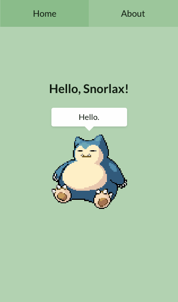

<h1 align="center">Hello Snorlax</h1>

<p align="center">
  <a href="#-running">Running</a>&nbsp;&nbsp;&nbsp;|&nbsp; 
  <a href="#-technologies">Technologies</a>
</p>

<p align="center">This repository is an educational guide to Gulp, an automation tool in web development that simplifies tasks like JavaScript minification, SASS compiling, and assets optimization. It demonstrates Gulp's integration with Handlebars for template management and SASS for efficient CSS preprocessing. Through a creative example featuring Snorlax, this project offers a practical understanding of using Gulp to optimize web development workflows.</p>

<p align="center">A wild Snorlax appears and says 'hello' using these technologies.</p>

<br />

<p align="center" style="border: 5px solid hsl(240 4.6% 22%);">
  
</p>

<br />

## 💻 Running

**Requirements**:

- `node >= 12`
- `npm >= 6`

#### 1. Clone the application

```sh
git clone https://github.com/arthursvpb/hello-snorlax.git
```

#### 2. Install dependencies & Run local dev server

```sh
npm i && npm run develop
```

#### 3. Project is running at: `http://localhost:3000/`

## ✨ Technologies

- [Gulp 4](https://gulpjs.com/)
- [Handlebars](https://handlebarsjs.com/)
- [SASS](https://sass-lang.com/)
- [Express](https://expressjs.com/)
